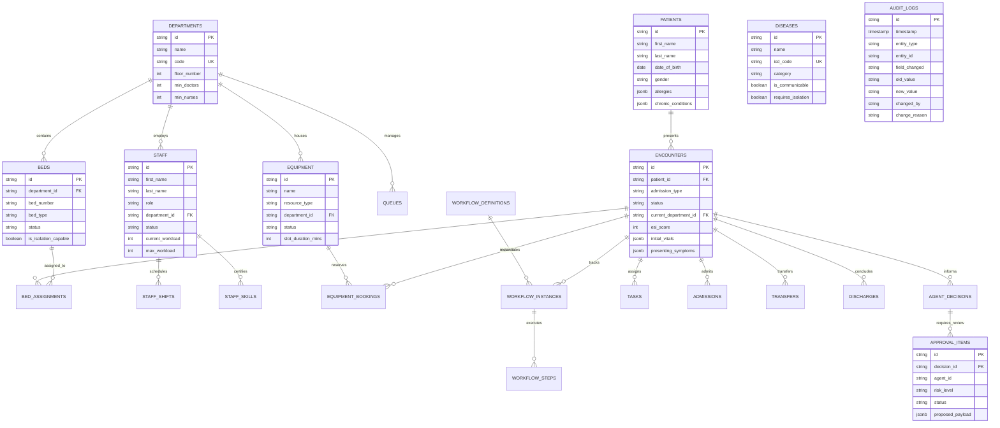

# Hospital Management System — Database Architecture & Data Dictionary

## 1. Database Overview
- **Database Engine:** PostgreSQL 15+ (ACID Compliant, Row-Level Concurrency)
- **Data Access Layer:** Python SQLAlchemy 2.0 (Async Core + AsyncPG Driver)
- **Design Paradigm:** Relational 3NF with JSONB Clinical Payload Flexibilities
- **Total Tables:** 28 Core Relational Tables

---

## 2. Entity Relationship Diagram (ERD)

---

## 3. Data Dictionary Summary (Core 28 Tables)

| Category | Table Name | Purpose | Primary Key | Foreign Keys |
| :--- | :--- | :--- | :--- | :--- |
| **Clinical** | `patients` | Master patient demographic and allergy records | `id` | None |
| **Clinical** | `encounters` | Inpatient/Emergency visits, ESI triage, vital signs | `id` | `patient_id`, `current_department_id`, `current_bed_id` |
| **Clinical** | `diseases` | 40 ICD-10 disease registry with isolation flags | `id` | None (`icd_code` unique) |
| **Infrastructure** | `departments` | 9 hospital departments (ER, ICU, Ward A/B, etc.) | `id` | None (`code` unique) |
| **Infrastructure** | `beds` | 44 beds with state tracking (AVAILABLE, RESERVED, OCCUPIED) | `id` | `department_id` |
| **Infrastructure** | `bed_assignments` | Historical timeline of patient bed occupancy | `id` | `bed_id`, `encounter_id`, `patient_id` |
| **Workforce** | `staff` | 33 staff members with workload tracking | `id` | `department_id` |
| **Workforce** | `staff_shifts` | Shift schedules (Morning, Evening, Night) | `id` | `staff_id`, `department_id` |
| **Workforce** | `staff_skills` | Certifications (ICU, Trauma, ACLS, BLS) | `id` | `staff_id` |
| **Resources** | `equipment` | 15 critical devices (CT, MRI, Ventilators, OTs) | `id` | `department_id` |
| **Resources** | `equipment_bookings` | Patient diagnostic and surgical reservations | `id` | `equipment_id`, `encounter_id`, `patient_id` |
| **Workflows** | `workflow_definitions` | Clinical pathway templates (Emergency, OPD, Transfer) | `id` | None |
| **Workflows** | `workflow_instances` | Live executed patient care pathways | `id` | `workflow_definition_id`, `encounter_id`, `patient_id` |
| **Workflows** | `workflow_steps` | Step progression and timestamp adherence | `id` | `instance_id` |
| **Workflows** | `queues` | Department queue depths and wait estimations | `id` | `department_id` |
| **Workflows** | `tasks` | Clinical task backlog and staff assignments | `id` | `encounter_id`, `assigned_to_id` |
| **Workflows** | `admissions` | Inpatient admission events | `id` | `encounter_id`, `patient_id`, `bed_id` |
| **Workflows** | `transfers` | Inter-department transfer requests and states | `id` | `encounter_id` |
| **Workflows** | `discharges` | Final discharge summaries and timestamps | `id` | `encounter_id`, `patient_id` |
| **Emergency** | `emergency_events` | Hospital surges (Mass Casualty, Epidemic) | `id` | None |
| **Analytics** | `prediction_runs` | Model inference logs, surge forecasts, latency | `id` | None |
| **AI Multi-Agent** | `agent_decisions` | Raw agent proposals with confidence and rationale | `id` | None |
| **AI Multi-Agent** | `agent_messages` | Inter-agent communication event payloads | `id` | None |
| **AI Multi-Agent** | `optimization_runs`| Mathematical solver optimization runs | `id` | None |
| **AI Multi-Agent** | `crew_runs` | CrewAI task executions and summaries | `id` | None |
| **AI Multi-Agent** | `langgraph_checkpoints` | State graph thread checkpoints | `id` | None |
| **Governance** | `approval_items` | Human-in-the-loop verification queue | `id` | `decision_id` |
| **Governance** | `audit_logs` | Immutable HIPAA security and change trail | `id` | None |
